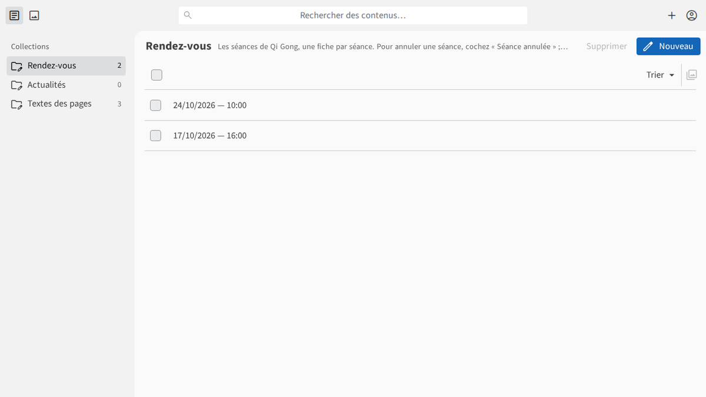
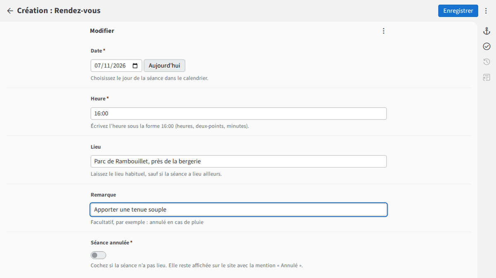
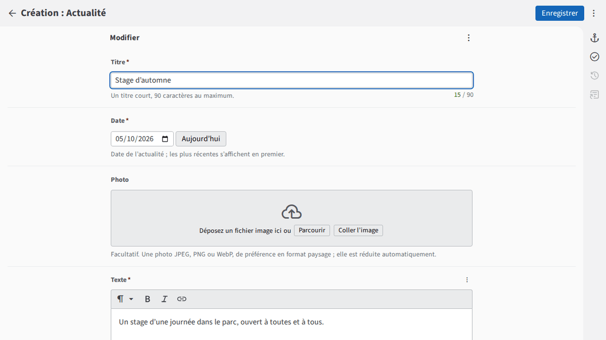
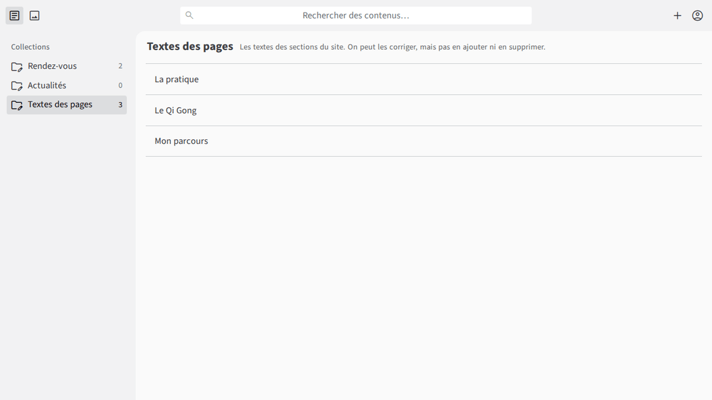

# Guide de l’administration du site Fan 2 Harmonie

Bonjour Stéphanie,

Ce petit guide vous accompagne pour faire vivre votre site : ajouter vos séances, publier une nouvelle,
corriger un texte. Tout se fait depuis votre navigateur, sans rien installer. Prenez votre temps : une erreur se
corrige simplement en modifiant de nouveau la fiche, et votre technicien peut toujours remettre une version
précédente du site.

## a) Se connecter

1. Ouvrez l’adresse **https://fan2harmonie.fr/admin** (gardez-la dans vos favoris).
2. Cliquez sur **« Se connecter avec GitHub »**. Une petite fenêtre s’ouvre.
3. Entrez votre identifiant et votre mot de passe GitHub, puis le code de la **double authentification**
   (l’application de votre téléphone). GitHub est le service gratuit qui garde les textes du site en lieu sûr.
4. La toute première fois, GitHub vous demande d’autoriser « Fan 2 Harmonie — administration ». Dans la fenêtre
   GitHub, vérifiez que l’adresse commence par https://github.com/ et que l’application s’appelle bien
   « Fan 2 Harmonie — administration » avant de cliquer sur « Authorize » (le bouton vert). La fenêtre se ferme
   toute seule et vous arrivez sur l’administration.
5. Se déconnecter ne retire pas l’accès à votre compte : si vous perdez votre ordinateur ou votre téléphone,
   prévenez votre technicien sans attendre, il coupera l’accès.

## b) Ajouter un rendez-vous

1. À gauche, cliquez sur **Rendez-vous**, puis sur le bouton bleu **Nouveau**.
2. **Date** : choisissez le jour dans le calendrier.
3. **Heure** : écrivez-la sous la forme **16:00** (les heures, deux-points, les minutes).
4. **Lieu** : laissez le lieu habituel, sauf si la séance a lieu ailleurs.
5. **Remarque** (facultatif) : par exemple « annulé en cas de pluie ».
6. Cliquez sur **Enregistrer** en haut à droite. Le message « Entrée enregistrée. » confirme l’enregistrement.

## c) Annuler une séance

Ouvrez le rendez-vous dans la liste, activez **« Séance annulée »** (le petit interrupteur à faire glisser),
puis **Enregistrer**. La séance reste affichée sur le site, barrée, avec la mention **« Annulé »** : vos élèves
savent ainsi qu’elle n’a pas lieu.

## d) Supprimer un rendez-vous

Pour retirer complètement une séance du site : dans la liste des rendez-vous, cochez la case devant la séance,
puis cliquez sur **Supprimer** et confirmez. (Inutile pour les séances passées : elles disparaissent seules.)

## e) Publier une actualité avec une photo

1. À gauche, cliquez sur **Actualités**, puis sur **Nouveau**.
2. **Titre** : court, 90 caractères au maximum.
3. **Date** : les actualités les plus récentes s’affichent en premier.
4. **Photo** (facultative) : cliquez sur **Parcourir**, puis choisissez une photo de votre ordinateur ou de votre
   téléphone (format JPEG, PNG ou WebP). Elle est réduite automatiquement : pas besoin de la retoucher.
   Ne publiez pas la photo d’une personne reconnaissable sans son accord.
5. **Texte** : écrivez votre nouvelle. Les boutons au-dessus permettent de mettre un mot en **gras** ou en
   *italique*, ou d’ajouter un lien.
6. **Enregistrer**.

## f) Corriger un texte

À gauche, cliquez sur **Textes des pages**, puis sur la section à corriger : **La pratique**, **Le Qi Gong** ou
**Mon parcours**. Modifiez le texte comme dans un traitement de texte, puis **Enregistrer**.

- Pour passer à la ligne, laissez **une ligne vide** entre deux paragraphes (appuyez deux fois sur « Entrée »).
- Écrivez simplement votre texte : pas de code ni de balises, les boutons suffisent pour le gras et l’italique.

## g) Quand le site se met-il à jour ?

Après chaque enregistrement, **le site se met à jour en quelques minutes** (votre technicien vous dira le délai
habituel, mesuré à la mise en ligne). Rechargez alors la page du site
pour voir le changement.

Si rien n’a changé au bout de cinq minutes : rechargez la page en appuyant sur **Ctrl + F5** (ou, sur téléphone,
fermez et rouvrez la page). Si le changement n’apparaît toujours pas après un quart d’heure, ce n’est pas grave :
votre modification est bien gardée, écrivez simplement au technicien (rubrique suivante).

## h) En cas de doute

Chaque modification est gardée : en cas d’erreur, votre technicien peut toujours remettre une version précédente
(vous ne pouvez pas le faire vous-même, mais vous n’en avez pas besoin). Si quelque chose vous paraît étrange, ne cherchez pas à réparer vous-même : écrivez à votre technicien,
**[adresse e-mail du technicien — à remplacer]**, en décrivant ce que vous avez fait et ce que vous voyez (une
capture d’écran aide beaucoup).

## i) Bon à savoir

- **Deux rendez-vous le même jour** (le matin et l’après-midi) : c’est possible, le site les distingue tout seul.
- **Les rendez-vous passés disparaissent tout seuls** du site : dès le lendemain dans la page affichée, puis
  du site lui-même lors de la mise à jour de la nuit. Inutile de les supprimer.
- **Ce qui est supprimé n’est pas effacé partout** : les fichiers du site sont publics sur GitHub, et une photo
  ou un texte supprimé du site reste visible dans l’historique des modifications. Réfléchissez donc avant de
  publier une information personnelle.
- **Quelques mots de l’outil restent en anglais**, par exemple « Show Errors » ou « Restore Default » : c’est
  normal, vous pouvez les ignorer.
- **Le champ Photo** affiche, une fois la photo choisie, un chemin un peu technique
  (« ../../assets/actualites/… ») : c’est normal, n’y touchez pas.
- **Formulaire de contact** : si un visiteur rencontre une erreur en envoyant un message, le site lui affiche
  votre adresse e-mail pour qu’il vous écrive directement.
- **Ne communiquez jamais votre mot de passe GitHub**, à personne (pas même au technicien) ; ni le code de la
  double authentification. Personne n’en a besoin pour vous aider.
- Sur un ordinateur partagé, pensez à vous déconnecter : cliquez sur le petit bonhomme en haut à droite, puis
  sur « Se déconnecter ».

Bonne publication !
